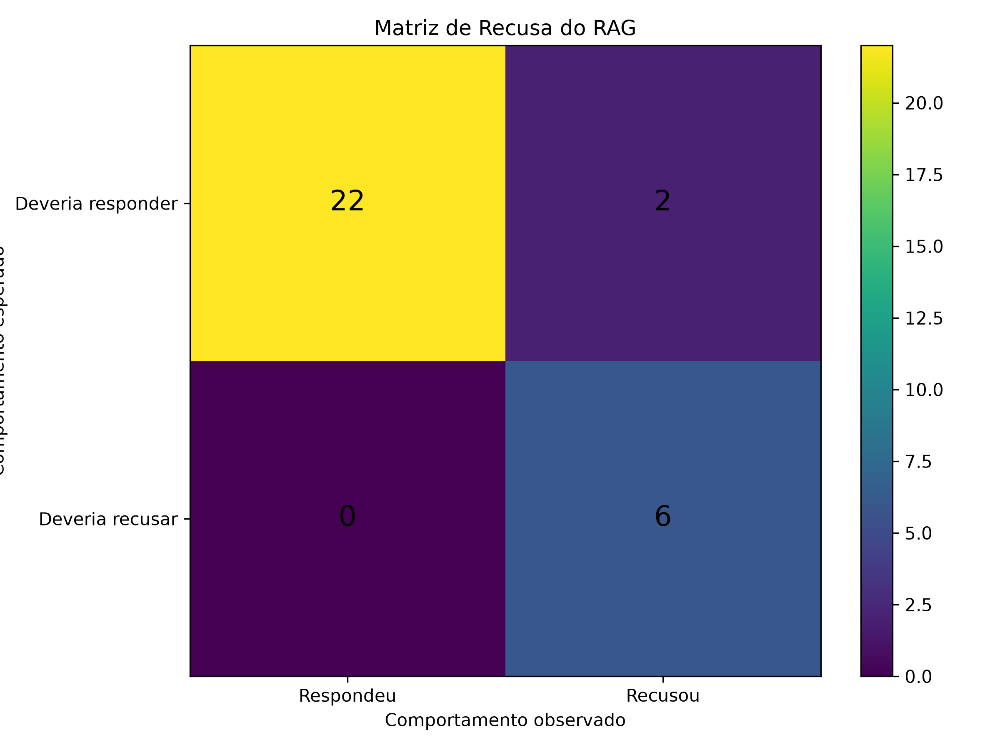

# Resultados da avaliacao RAG

Relatorio gerado por `python eval/evaluate_rag.py`.

## Resumo

- Total de perguntas: 30
- Avaliadas automaticamente: 30
- Aprovadas automaticamente: 13
- Fidelidade Média (Claim-level): 100.0%
- Revisao manual: 0
- Recuperacao ok: 10/23 (43.5%)
- Geracao ok: 18/30 (60.0%)
- Recusa fora do acervo ok: 6/6 (100.0%)
- Latencia media: 4249 ms

A avaliacao usa gold set versionado com resposta esperada, termos
obrigatorios/proibidos, fonte esperada e comportamento de recusa.

## Metricas do LLM as a Judge

- Taxa de Fidelidade (Faithfulness): 83.3%
- Taxa de Relevancia (Answer Relevancy): 83.3%
- Taxa de Aderencia a Recusa (Refusal): 83.3%

## Metricas da camada de recuperacao

- Casos com chunks positivos anotados: 16
- Context Recall@2: 56.2%
- Context Precision@2: 34.4%
- Hit Rate@1: 50.0%
- Hit Rate@2: 62.5%
- Hit Rate@5: 87.5%
- Hit Rate@10: 87.5%
- MRR@10: 0.646

Context Precision@2 considera somente os chunks positivos anotados
no golden set; chunks relevantes nao anotados sao contabilizados como
nao relevantes.

## Estudo de Ablation (Variação de Hiperparâmetros)

Comparação mantendo tamanho de chunk e overlap fixos, alterando apenas o fator `top_k`:

| Configuração | Fidelidade Média | Latência Média | Taxa de Sucesso |
| --- | ---: | ---: | ---: |
| top_k = 1 | 96.2% | 3978 ms | 40.0% |
| top_k = 2 | 96.6% | 7528 ms | 43.3% |
| top_k = 4 | 97.2% | 11176 ms | 43.3% |

## Resultados por pergunta

| ID | Categoria | Status | Recuperacao | Geracao | Juiz (F/R/Ref) | Claims | Fidelidade | Citacao | Latencia | Fontes | Docs | Recusa | Checks com falha |
| --- | --- | --- | --- | --- | --- | --- | ---: | --- | ---: | ---: | ---: | --- | --- |
| bula_001 | bula | ok | ok | ok | 1/1/1 | 2/2 | 100.0% | sim | 6049 ms | 2 | 2 | nao | - |
| bula_002 | bula | falha | falha | falha | 1/1/1 | 3/3 | 100.0% | sim | 6900 ms | 2 | 2 | nao | termos_obrigatorios, fonte_chunk, fonte_pagina |
| bula_003 | bula | falha | falha | falha | 0/0/0 | 1/1 | 100.0% | sim | 6584 ms | 2 | 2 | nao | termos_obrigatorios, fonte_chunk |
| bula_004 | bula | falha | falha | falha | 1/1/1 | 2/2 | 100.0% | sim | 5670 ms | 2 | 2 | nao | termos_obrigatorios, fonte_chunk |
| bula_005 | bula | falha | ok | falha | 1/1/1 | 2/2 | 100.0% | sim | 5906 ms | 2 | 2 | nao | termos_obrigatorios |
| bula_006 | bula | falha | falha | falha | 0/0/0 | 1/1 | 100.0% | sim | 1743 ms | 2 | 2 | nao | termos_obrigatorios, fonte_chunk, fonte_pagina |
| bula_007 | bula | falha | ok | falha | 1/1/1 | 2/2 | 100.0% | sim | 5668 ms | 2 | 2 | nao | termos_obrigatorios |
| bula_008 | bula | ok | ok | ok | 1/1/1 | 6/6 | 100.0% | sim | 10816 ms | 2 | 2 | nao | - |
| bula_009 | bula | falha | falha | falha | 0/0/0 | 0/0 | 0.0% | sim | 1124 ms | 2 | 2 | sim | recusa_esperada, termos_obrigatorios, fonte_chunk, fonte_pagina |
| bula_010 | bula | falha | ok | falha | 1/1/1 | 1/1 | 100.0% | sim | 3358 ms | 2 | 2 | nao | termos_obrigatorios |
| bula_011 | bula | ok | ok | ok | 1/1/1 | 3/3 | 100.0% | sim | 7841 ms | 2 | 2 | nao | - |
| bula_012 | bula | falha | falha | falha | 0/0/0 | 0/0 | 0.0% | sim | 1177 ms | 2 | 2 | sim | recusa_esperada, termos_obrigatorios, fonte_chunk |
| bula_013 | bula | ok | ok | ok | 1/1/1 | 1/1 | 100.0% | sim | 1791 ms | 2 | 2 | nao | - |
| bula_014 | bula | ok | ok | ok | 1/1/1 | 1/1 | 100.0% | sim | 3357 ms | 2 | 2 | nao | - |
| bula_015 | bula | ok | ok | ok | 1/1/1 | 1/1 | 100.0% | sim | 2469 ms | 2 | 2 | nao | - |
| bula_016 | bula | falha | ok | falha | 1/1/1 | 1/1 | 100.0% | sim | 7634 ms | 2 | 2 | nao | termos_obrigatorios |
| paciente_001 | dados_paciente | falha | falha | ok | 1/1/1 | 1/1 | 100.0% | sim | 4132 ms | 2 | 2 | nao | metadados_recuperados |
| paciente_002 | dados_paciente | falha | falha | falha | 1/1/1 | 1/1 | 100.0% | sim | 1800 ms | 2 | 2 | nao | termos_obrigatorios, metadados_recuperados |
| paciente_003 | dados_paciente | falha | falha | ok | 1/1/1 | 1/1 | 100.0% | sim | 2564 ms | 2 | 2 | nao | metadados_recuperados |
| paciente_004 | dados_paciente | ok | ok | ok | 1/1/1 | 7/7 | 100.0% | sim | 9054 ms | 2 | 2 | nao | - |
| paciente_005 | dados_paciente | falha | falha | ok | 1/1/1 | 2/2 | 100.0% | sim | 4659 ms | 2 | 2 | nao | metadados_recuperados |
| paciente_006 | dados_paciente | falha | falha | ok | 1/1/1 | 1/1 | 100.0% | sim | 1167 ms | 2 | 2 | nao | metadados_recuperados |
| paciente_007 | dados_paciente | falha | falha | falha | 0/0/0 | 1/1 | 100.0% | sim | 4995 ms | 2 | 2 | nao | termos_obrigatorios, metadados_recuperados |
| paciente_008 | dados_paciente | falha | falha | ok | 1/1/1 | 1/1 | 100.0% | sim | 5581 ms | 2 | 2 | nao | metadados_recuperados |
| fora_001 | fora_do_acervo | ok | ok | ok | 1/1/1 | 0/0 | 0.0% | sim | 1089 ms | 2 | 2 | sim | - |
| fora_002 | fora_do_acervo | ok | ok | ok | 1/1/1 | 0/0 | 0.0% | sim | 5481 ms | 2 | 2 | sim | - |
| fora_003 | fora_do_acervo | ok | ok | ok | 1/1/1 | 0/0 | 0.0% | sim | 1007 ms | 2 | 2 | sim | - |
| fora_004 | fora_do_acervo | ok | ok | ok | 1/1/1 | 0/0 | 0.0% | sim | 1012 ms | 2 | 2 | sim | - |
| fora_005 | fora_do_acervo | ok | ok | ok | 1/1/1 | 0/0 | 0.0% | sim | 1113 ms | 2 | 2 | sim | - |
| fora_006 | fora_do_acervo | ok | ok | ok | 1/1/1 | 0/0 | 0.0% | sim | 5725 ms | 2 | 2 | sim | - |

## Metricas de recuperacao por pergunta

| ID | Context Recall@2 | Context Precision@2 | Hit Rate@1 | Hit Rate@2 | Hit Rate@5 | Hit Rate@10 | MRR@10 |
| --- | ---: | ---: | ---: | ---: | ---: | ---: | ---: |
| bula_001 | 100.0% | 50.0% | 1 | 1 | 1 | 1 | 1.000 |
| bula_002 | 0.0% | 0.0% | 0 | 0 | 0 | 0 | 0.000 |
| bula_003 | 0.0% | 0.0% | 0 | 0 | 1 | 1 | 0.333 |
| bula_004 | 0.0% | 0.0% | 0 | 0 | 1 | 1 | 0.333 |
| bula_005 | 100.0% | 100.0% | 1 | 1 | 1 | 1 | 1.000 |
| bula_006 | 0.0% | 0.0% | 0 | 0 | 0 | 0 | 0.000 |
| bula_007 | 50.0% | 50.0% | 1 | 1 | 1 | 1 | 1.000 |
| bula_008 | 50.0% | 50.0% | 1 | 1 | 1 | 1 | 1.000 |
| bula_009 | 0.0% | 0.0% | 0 | 0 | 1 | 1 | 0.333 |
| bula_010 | 100.0% | 50.0% | 1 | 1 | 1 | 1 | 1.000 |
| bula_011 | 100.0% | 50.0% | 1 | 1 | 1 | 1 | 1.000 |
| bula_012 | 0.0% | 0.0% | 0 | 0 | 1 | 1 | 0.333 |
| bula_013 | 100.0% | 50.0% | 0 | 1 | 1 | 1 | 0.500 |
| bula_014 | 100.0% | 50.0% | 0 | 1 | 1 | 1 | 0.500 |
| bula_015 | 100.0% | 50.0% | 1 | 1 | 1 | 1 | 1.000 |
| bula_016 | 100.0% | 50.0% | 1 | 1 | 1 | 1 | 1.000 |

## Observacoes

- bula_002: revisar resposta manualmente; criterio automatico marcou falha.
- bula_003: revisar resposta manualmente; criterio automatico marcou falha.
- bula_004: revisar resposta manualmente; criterio automatico marcou falha.
- bula_005: revisar resposta manualmente; criterio automatico marcou falha.
- bula_006: revisar resposta manualmente; criterio automatico marcou falha.
- bula_007: revisar resposta manualmente; criterio automatico marcou falha.
- bula_009: revisar resposta manualmente; criterio automatico marcou falha.
- bula_010: revisar resposta manualmente; criterio automatico marcou falha.
- bula_012: revisar resposta manualmente; criterio automatico marcou falha.
- bula_016: revisar resposta manualmente; criterio automatico marcou falha.
- paciente_001: revisar resposta manualmente; criterio automatico marcou falha.
- paciente_002: revisar resposta manualmente; criterio automatico marcou falha.
- paciente_003: revisar resposta manualmente; criterio automatico marcou falha.
- paciente_005: revisar resposta manualmente; criterio automatico marcou falha.
- paciente_006: revisar resposta manualmente; criterio automatico marcou falha.
- paciente_007: revisar resposta manualmente; criterio automatico marcou falha.
- paciente_008: revisar resposta manualmente; criterio automatico marcou falha.

## Matriz de Recusa

A matriz compara o comportamento esperado com o comportamento observado do sistema, permitindo identificar recusas corretas, respostas indevidas e recusas indevidas.
Partindo dos testes do golden set com 30, foi feito um plot da imagem com a matriz de recusa com o casos.

| Esperado / Observado | Respondeu | Recusou |
| --- | ---: | ---: |
| Deveria responder | 22 | 2 |
| Deveria recusar | 0 | 6 |

## Melhoria futura

- Mutation testing nao foi implementado nesta rodada; pode ser avaliado
  depois que a suite base estiver estavel.
